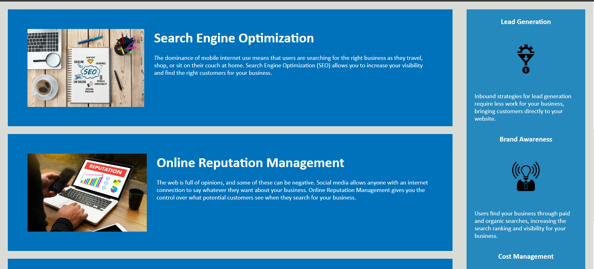
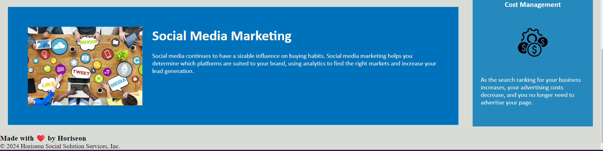

Horiseon

I was given some code that needed to be refactored. While working on refacoring this code I learned how to use semantic elements, clean up my style sheets to make it easier to read, and learned the how to comment on your code to make it meet accessibility standards.

The way this website works is simple. At the top you find a navigation bar, you can click on any of the topics on that navigation bar and it will direct you to that section of the webpage, where you can learn more about that topic. This webpage is informational only.

Here are some pictures of the deployed site.

Here is a link to the website:
